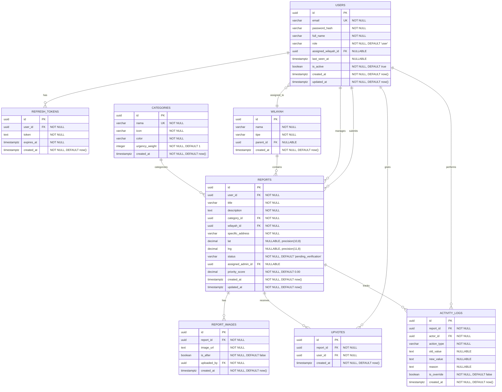

# Database Design Document — LaporRuta

## 1. Entity Relationship Diagram



---

## 2. Data Dictionary Matrix

### 2.1 `users`

Tabel utama untuk autentikasi dan profil seluruh pengguna (warga, admin wilayah, admin pusat).

| Column Name           | Data Type      | Constraints                           | Description                                                              |
| --------------------- | -------------- | ------------------------------------- | ------------------------------------------------------------------------ |
| `id`                  | `UUID`         | **PK**, `gen_random_uuid()`           | Identitas unik pengguna.                                                 |
| `email`               | `VARCHAR(255)` | **UK**, `NOT NULL`                    | Alamat email untuk login; harus unik.                                    |
| `password_hash`       | `VARCHAR(255)` | `NOT NULL`                            | Hash password (bcrypt) — tidak pernah menyimpan plain-text.              |
| `full_name`           | `VARCHAR(255)` | `NOT NULL`                            | Nama lengkap pengguna.                                                   |
| `role`                | `VARCHAR(50)`  | `NOT NULL`, `DEFAULT 'user'`, `CHECK` | Peran: `user` \| `admin_wilayah` \| `admin_pusat`.                       |
| `assigned_wilayah_id` | `UUID`         | **FK** → `wilayah.id`, `NULLABLE`     | Zona tugas khusus untuk `admin_wilayah`; `NULL` untuk peran lain.        |
| `last_seen_at`        | `TIMESTAMPTZ`  | `NULLABLE`                            | Waktu terakhir pengguna memuat halaman (untuk indikator "belum dibaca"). |
| `is_active`           | `BOOLEAN`      | `NOT NULL`, `DEFAULT true`            | Status akun aktif; `false` untuk akun yang dinonaktifkan.                |
| `created_at`          | `TIMESTAMPTZ`  | `NOT NULL`, `DEFAULT now()`           | Waktu pembuatan akun.                                                    |
| `updated_at`          | `TIMESTAMPTZ`  | `NOT NULL`, `DEFAULT now()`           | Waktu terakhir diperbarui (di-update via trigger).                       |

**Relational Integrity:**

- `assigned_wilayah_id` referensial ke `wilayah.id` dengan `ON DELETE SET NULL`.
- `CHECK (role IN ('user', 'admin_wilayah', 'admin_pusat'))`.
- `CHECK (role != 'admin_wilayah' OR assigned_wilayah_id IS NOT NULL)` — Admin Wilayah wajib memiliki zona tugas.

---

### 2.2 `refresh_tokens`

Tabel penyimpanan refresh token untuk manajemen sesi JWT.

| Column Name  | Data Type     | Constraints                     | Description                                             |
| ------------ | ------------- | ------------------------------- | ------------------------------------------------------- |
| `id`         | `UUID`        | **PK**, `gen_random_uuid()`     | Identitas unik token.                                   |
| `user_id`    | `UUID`        | **FK** → `users.id`, `NOT NULL` | Pemilik token.                                          |
| `token`      | `TEXT`        | `NOT NULL`                      | String refresh token (hash jika diperlukan).            |
| `expires_at` | `TIMESTAMPTZ` | `NOT NULL`                      | Batas waktu kedaluwarsa token (7 hari sejak pembuatan). |
| `created_at` | `TIMESTAMPTZ` | `NOT NULL`, `DEFAULT now()`     | Waktu token diterbitkan.                                |

**Relational Integrity:**

- `user_id` referensial ke `users.id` dengan `ON DELETE CASCADE`.
- Token yang `expires_at < now()` harus dihapus secara berkala (scheduled cleanup).

---

### 2.3 `wilayah`

Tabel data master lokasi administratif bertingkat (Provinsi → Kota → Kecamatan → Kelurahan).

| Column Name  | Data Type      | Constraints                       | Description                                                          |
| ------------ | -------------- | --------------------------------- | -------------------------------------------------------------------- |
| `id`         | `UUID`         | **PK**, `gen_random_uuid()`       | Identitas unik wilayah.                                              |
| `nama`       | `VARCHAR(255)` | `NOT NULL`                        | Nama wilayah (contoh: "DKI Jakarta", "Tebet").                       |
| `tipe`       | `VARCHAR(50)`  | `NOT NULL`, `CHECK`               | Jenis: `provinsi` \| `kota` \| `kecamatan` \| `kelurahan`.           |
| `parent_id`  | `UUID`         | **FK** → `wilayah.id`, `NULLABLE` | Referensi ke wilayah induk; `NULL` untuk provinsi (level tertinggi). |
| `created_at` | `TIMESTAMPTZ`  | `NOT NULL`, `DEFAULT now()`       | Waktu entri dibuat.                                                  |

**Relational Integrity:**

- `parent_id` referensial ke `wilayah.id` dengan `ON DELETE CASCADE`.
- `CHECK (tipe IN ('provinsi', 'kota', 'kecamatan', 'kelurahan'))`.
- `CHECK (tipe = 'provinsi' OR parent_id IS NOT NULL)` — Wilayah non-provinsi wajib memiliki induk.

---

### 2.4 `categories`

Tabel data master kategori kerusakan infrastruktur.

| Column Name      | Data Type      | Constraints                  | Description                                                         |
| ---------------- | -------------- | ---------------------------- | ------------------------------------------------------------------- |
| `id`             | `UUID`         | \*\*PK`, `gen_random_uuid()` | Identitas unik kategori.                                            |
| `nama`           | `VARCHAR(255)` | **UK**, `NOT NULL`           | Nama kategori (contoh: "Jalan Berlubang", "Lampu Penerangan Mati"). |
| `icon`           | `VARCHAR(100)` | `NOT NULL`                   | Nama ikon Lucide yang digunakan di UI.                              |
| `color`          | `VARCHAR(50)`  | `NOT NULL`                   | Kode warna hex untuk marker peta (contoh: `#EF4444`).               |
| `urgency_weight` | `INTEGER`      | `NOT NULL`, `DEFAULT 1`      | Bobot urgensi (1–5) untuk perhitungan skor prioritas.               |
| `created_at`     | `TIMESTAMPTZ`  | `NOT NULL`, `DEFAULT now()`  | Waktu entri dibuat.                                                 |

**Relational Integrity:**

- `CHECK (urgency_weight BETWEEN 1 AND 5)`.
- Tidak boleh dihapus jika masih direferens oleh `reports` (`ON DELETE RESTRICT`).

---

### 2.5 `reports`

Tabel inti untuk laporan kerusakan infrastruktur.

| Column Name         | Data Type       | Constraints                                           | Description                                        |
| ------------------- | --------------- | ----------------------------------------------------- | -------------------------------------------------- |
| `id`                | `UUID`          | **PK**, `gen_random_uuid()`                           | Identitas unik laporan.                            |
| `user_id`           | `UUID`          | **FK** → `users.id`, `NOT NULL`                       | Pelapor (warga yang membuat laporan).              |
| `title`             | `VARCHAR(100)`  | `NOT NULL`                                            | Judul singkat laporan (maks. 100 karakter).        |
| `description`       | `TEXT`          | `NOT NULL`                                            | Deskripsi detail kerusakan (maks. 500 karakter).   |
| `category_id`       | `UUID`          | **FK** → `categories.id`, `NOT NULL`                  | Kategori kerusakan.                                |
| `wilayah_id`        | `UUID`          | **FK** → `wilayah.id`, `NOT NULL`                     | Zona administratif laporan (kecamatan/kelurahan).  |
| `specific_address`  | `VARCHAR(200)`  | `NOT NULL`                                            | Alamat spesifik dalam teks bebas.                  |
| `lat`               | `DECIMAL(10,8)` | `NULLABLE`                                            | Latitude dari pin peta (opsional).                 |
| `lng`               | `DECIMAL(11,8)` | `NULLABLE`                                            | Longitude dari pin peta (opsional).                |
| `status`            | `VARCHAR(50)`   | `NOT NULL`, `DEFAULT 'pending_verification'`, `CHECK` | Status siklus hidup laporan.                       |
| `assigned_admin_id` | `UUID`          | **FK** → `users.id`, `NULLABLE`                       | Admin yang ditugaskan menangani laporan ini.       |
| `priority_score`    | `DECIMAL(8,2)`  | `NOT NULL`, `DEFAULT 0.00`                            | Skor prioritas terhitung untuk sorting admin.      |
| `created_at`        | `TIMESTAMPTZ`   | `NOT NULL`, `DEFAULT now()`                           | Waktu laporan dibuat.                              |
| `updated_at`        | `TIMESTAMPTZ`   | `NOT NULL`, `DEFAULT now()`                           | Waktu terakhir diperbarui (di-update via trigger). |

**Relational Integrity:**

- `user_id` → `users.id` `ON DELETE RESTRICT` (jangan hapus warga yang punya laporan).
- `category_id` → `categories.id` `ON DELETE RESTRICT`.
- `wilayah_id` → `wilayah.id` `ON DELETE RESTRICT`.
- `assigned_admin_id` → `users.id` `ON DELETE SET NULL`.
- `CHECK (status IN ('pending_verification', 'verified', 'in_progress', 'resolved', 'rejected'))`.
- `CHECK (priority_score >= 0)`.

---

### 2.6 `report_images`

Tabel penyimpanan referensi gambar untuk setiap laporan.

| Column Name   | Data Type     | Constraints                       | Description                                           |
| ------------- | ------------- | --------------------------------- | ----------------------------------------------------- |
| `id`          | `UUID`        | **PK**, `gen_random_uuid()`       | Identitas unik gambar.                                |
| `report_id`   | `UUID`        | **FK** → `reports.id`, `NOT NULL` | Laporan pemilik gambar.                               |
| `image_url`   | `TEXT`        | `NOT NULL`                        | URL publik gambar di Supabase Storage.                |
| `is_after`    | `BOOLEAN`     | `NOT NULL`, `DEFAULT false`       | `true` jika gambar adalah bukti "sesudah" perbaikan.  |
| `uploaded_by` | `UUID`        | **FK** → `users.id`, `NOT NULL`   | Pengguna yang mengunggah gambar (pelapor atau admin). |
| `created_at`  | `TIMESTAMPTZ` | `NOT NULL`, `DEFAULT now()`       | Waktu unggah.                                         |

**Relational Integrity:**

- `report_id` → `reports.id` `ON DELETE CASCADE`.
- `uploaded_by` → `users.id` `ON DELETE RESTRICT`.

---

### 2.7 `upvotes`

Tabel pencatatan upvote komunitas per laporan.

| Column Name  | Data Type     | Constraints                       | Description                      |
| ------------ | ------------- | --------------------------------- | -------------------------------- |
| `id`         | `UUID`        | **PK**, `gen_random_uuid()`       | Identitas unik upvote.           |
| `report_id`  | `UUID`        | **FK** → `reports.id`, `NOT NULL` | Laporan yang di-upvote.          |
| `user_id`    | `UUID`        | **FK** → `users.id`, `NOT NULL`   | Pengguna yang memberikan upvote. |
| `created_at` | `TIMESTAMPTZ` | `NOT NULL`, `DEFAULT now()`       | Waktu upvote diberikan.          |

**Relational Integrity:**

- `report_id` → `reports.id` `ON DELETE CASCADE`.
- `user_id` → `users.id` `ON DELETE CASCADE`.
- **Composite Unique:** `(report_id, user_id)` — mencegah duplikat upvote.

---

### 2.8 `activity_logs`

Tabel audit trail immutable untuk mencatat seluruh tindakan pada laporan.

| Column Name   | Data Type     | Constraints                       | Description                                                      |
| ------------- | ------------- | --------------------------------- | ---------------------------------------------------------------- |
| `id`          | `UUID`        | **PK**, `gen_random_uuid()`       | Identitas unik log.                                              |
| `report_id`   | `UUID`        | **FK** → `reports.id`, `NOT NULL` | Laporan terkait tindakan.                                        |
| `actor_id`    | `UUID`        | **FK** → `users.id`, `NOT NULL`   | Pengguna atau admin yang melakukan tindakan.                     |
| `action_type` | `VARCHAR(50)` | `NOT NULL`, `CHECK`               | Jenis tindakan.                                                  |
| `old_value`   | `TEXT`        | `NULLABLE`                        | Nilai sebelum perubahan (untuk perubahan status, dll).           |
| `new_value`   | `TEXT`        | `NULLABLE`                        | Nilai setelah perubahan.                                         |
| `reason`      | `TEXT`        | `NULLABLE`                        | Alasan tindakan (wajib untuk penolakan, opsional untuk lainnya). |
| `is_override` | `BOOLEAN`     | `NOT NULL`, `DEFAULT false`       | `true` jika tindakan adalah override oleh Admin Pusat.           |
| `created_at`  | `TIMESTAMPTZ` | `NOT NULL`, `DEFAULT now()`       | Waktu tindakan terjadi.                                          |

**Relational Integrity:**

- `report_id` → `reports.id` `ON DELETE CASCADE`.
- `actor_id` → `users.id` `ON DELETE RESTRICT`.
- `CHECK (action_type IN ('create', 'upvote', 'unvote', 'verify', 'reject', 'status_change', 'reassign', 'override', 'note_added'))`.
- `CHECK (action_type != 'reject' OR reason IS NOT NULL)` — Alasan wajib untuk penolakan.

---

## 3. Performance Optimization Plan

### 3.1 Indexing Strategy

| Index Name                   | Table            | Columns                        | Type            | Purpose                                                         |
| ---------------------------- | ---------------- | ------------------------------ | --------------- | --------------------------------------------------------------- |
| `idx_users_email`            | `users`          | `email`                        | B-Tree (Unique) | Lookup cepat saat login; sudah enforced oleh constraint UK.     |
| `idx_users_role_wilayah`     | `users`          | `role`, `assigned_wilayah_id`  | B-Tree          | Filter admin wilayah saat routing dan assignment.               |
| `idx_users_active`           | `users`          | `is_active`                    | B-Tree          | Filter akun aktif saat autentikasi.                             |
| `idx_refresh_token_lookup`   | `refresh_tokens` | `token`                        | B-Tree          | Verifikasi refresh token saat rotation.                         |
| `idx_refresh_token_user`     | `refresh_tokens` | `user_id`                      | B-Tree          | Hapus semua token user saat logout.                             |
| `idx_wilayah_parent`         | `wilayah`        | `parent_id`                    | B-Tree          | Query hierarki lokasi (children lookup).                        |
| `idx_wilayah_tipe`           | `wilayah`        | `tipe`                         | B-Tree          | Filter berdasarkan level administrasi.                          |
| `idx_reports_user_created`   | `reports`        | `user_id`, `created_at DESC`   | B-Tree          | Halaman "Laporan Saya" — urutkan terbaru dulu.                  |
| `idx_reports_wilayah_status` | `reports`        | `wilayah_id`, `status`         | B-Tree          | Dashboard Admin Wilayah — filter antrian.                       |
| `idx_reports_status_created` | `reports`        | `status`, `created_at`         | B-Tree          | Peta publik — ambil laporan terverifikasi/in-progress/resolved. |
| `idx_reports_category`       | `reports`        | `category_id`                  | B-Tree          | Filter peta berdasarkan kategori.                               |
| `idx_reports_admin`          | `reports`        | `assigned_admin_id`            | B-Tree          | Lookup laporan per admin yang ditugaskan.                       |
| `idx_reports_priority`       | `reports`        | `priority_score DESC`          | B-Tree          | Sorting default dashboard admin (prioritas tertinggi).          |
| `idx_reports_geo`            | `reports`        | `lat`, `lng`                   | B-Tree          | Query radius untuk deteksi duplikat (post-MVP).                 |
| `idx_report_images_report`   | `report_images`  | `report_id`                    | B-Tree          | Ambil semua gambar per laporan.                                 |
| `idx_upvotes_unique`         | `upvotes`        | `report_id`, `user_id`         | B-Tree (Unique) | Enforcement 1 upvote per user per laporan; lookup toggle.       |
| `idx_upvotes_user`           | `upvotes`        | `user_id`                      | B-Tree          | Cek laporan yang di-upvote user (opsional).                     |
| `idx_activity_report_time`   | `activity_logs`  | `report_id`, `created_at DESC` | B-Tree          | Timeline aktivitas per laporan (urut terbaru).                  |
| `idx_activity_actor`         | `activity_logs`  | `actor_id`, `created_at DESC`  | B-Tree          | Audit trail per aktor.                                          |

### 3.2 Additional Optimization Policies

| Policy                           | Implementation                                                                                                    | Rationale                                                                                           |
| -------------------------------- | ----------------------------------------------------------------------------------------------------------------- | --------------------------------------------------------------------------------------------------- |
| **Partitioning Strategy**        | Pertimbangkan partisi `activity_logs` berdasarkan `created_at` (monthly range) jika volume > 1 juta record.       | Audit trail tumbuh pesat; partisi mempercepat query timeline dan archival.                          |
| **Soft Delete**                  | Tidak diimplementasikan. Laporan yang `rejected` tetap ada dengan status terminal.                                | Integritas audit trail memerlukan record tetap ada; hapus permanen dilarang.                        |
| **Image Storage**                | Gambar disimpan di Supabase Storage; tabel hanya menyimpan URL publik.                                            | Offload binary blob dari database; scaling storage independen.                                      |
| **Priority Score Recalculation** | Hitung ulang `priority_score` via trigger saat INSERT/UPDATE pada `upvotes`, atau hitung on-the-fly di API layer. | Jika frekuensi upvote tinggi, pertimbangkan materialized view atau scheduled recalc setiap 5 menit. |
| **Connection Pooling**           | Gunakan connection pooler (PgBouncer / Supabase built-in) dengan max 50–100 connections.                          | Mencegah connection exhaustion saat load tinggi, terutama dengan real-time Socket.io.               |
| **Query Timeout**                | Set statement_timeout = 10s untuk query user-facing.                                                              | Mencegah query runaway memblokir connection pool.                                                   |

---

## 4. Data Seeding Specifications

### 4.1 Seeding Order (Dependency Chain)

Seed **harus** dilakukan dalam urutan berikut untuk menjaga integritas referensial:

```
1. wilayah      (parent first: provinsi → kota → kecamatan → kelurahan)
2. categories   (master kategori)
3. users        (admin pusat → admin wilayah → warga)
4. reports      (laporan dengan status variatif)
5. report_images (gambar per laporan)
6. upvotes      (upvote komunitas)
7. activity_logs (audit trail)
8. refresh_tokens (jika diperlukan untuk testing session)
```

### 4.2 Seed Data Structure

#### A. Master Wilayah (Minimal 1 Rantai Lengkap)

| Level     | Nama            | Parent          |
| --------- | --------------- | --------------- |
| Provinsi  | DKI Jakarta     | —               |
| Kota      | Jakarta Selatan | DKI Jakarta     |
| Kecamatan | Tebet           | Jakarta Selatan |
| Kecamatan | Setiabudi       | Jakarta Selatan |
| Kelurahan | Kebon Baru      | Tebet           |
| Kelurahan | Manggarai       | Tebet           |
| Kelurahan | Karet           | Setiabudi       |
| Kelurahan | Kuningan        | Setiabudi       |

#### B. Master Categories

| Nama                   | Icon         | Color     | Urgency Weight |
| ---------------------- | ------------ | --------- | -------------- |
| Jalan Berlubang        | `Road`       | `#EF4444` | 5              |
| Tiang Listrik Roboh    | `Zap`        | `#DC2626` | 5              |
| Lampu Penerangan Mati  | `Lightbulb`  | `#F59E0B` | 4              |
| Drainase Tersumbat     | `Droplets`   | `#3B82F6` | 3              |
| Trotoar Rusak          | `Footprints` | `#6366F1` | 2              |
| Fasilitas Publik Rusak | `Building`   | `#10B981` | 1              |

#### C. Users (Minimal 8 Akun)

| #   | Role            | Full Name      | Assigned Wilayah | Keterangan                                 |
| --- | --------------- | -------------- | ---------------- | ------------------------------------------ |
| 1   | `admin_pusat`   | Pak Dedi       | `NULL`           | Super admin                                |
| 2   | `admin_wilayah` | Ibu Rina       | Tebet            | Admin Kec. Tebet                           |
| 3   | `admin_wilayah` | Pak Budi       | Setiabudi        | Admin Kec. Setiabudi                       |
| 4   | `user`          | Budi Santoso   | `NULL`           | Warga aktif                                |
| 5   | `user`          | Ani Wulandari  | `NULL`           | Warga aktif                                |
| 6   | `user`          | Dedi Kurniawan | `NULL`           | Warga jarang lapor                         |
| 7   | `user`          | Siti Aminah    | `NULL`           | Warga baru                                 |
| 8   | `user`          | Rudi Hartono   | `NULL`           | Warga, akun nonaktif (`is_active = false`) |

#### D. Reports (Minimal 12 Laporan — Variatif Status)

| #   | Status                 | Wilayah   | Category         | Has Images  | Has Pin | Upvotes | Keterangan                                 |
| --- | ---------------------- | --------- | ---------------- | ----------- | ------- | ------- | ------------------------------------------ |
| 1   | `pending_verification` | Tebet     | Jalan Berlubang  | Yes         | Yes     | 0       | Menunggu verifikasi Ibu Rina               |
| 2   | `pending_verification` | Setiabudi | Lampu Penerangan | Yes         | No      | 0       | Menunggu verifikasi Pak Budi               |
| 3   | `pending_verification` | Karet     | Trotoar Rusak    | No          | Yes     | 0       | Zona tanpa admin → fallback ke Admin Pusat |
| 4   | `verified`             | Tebet     | Drainase         | Yes         | Yes     | 12      | Sudah terverifikasi, muncul di peta        |
| 5   | `verified`             | Setiabudi | Jalan Berlubang  | Yes         | Yes     | 8       | Sudah terverifikasi, muncul di peta        |
| 6   | `in_progress`          | Tebet     | Lampu Penerangan | Yes         | Yes     | 15      | Sedang dikerjakan                          |
| 7   | `in_progress`          | Setiabudi | Fasilitas Publik | No          | No      | 3       | Sedang dikerjakan                          |
| 8   | `resolved`             | Tebet     | Jalan Berlubang  | Yes (after) | Yes     | 20      | Selesai, ada foto sesudah                  |
| 9   | `resolved`             | Setiabudi | Drainase         | Yes (after) | Yes     | 5       | Selesai                                    |
| 10  | `rejected`             | Tebet     | Trotoar Rusak    | Yes         | No      | 0       | Ditolak dengan alasan                      |
| 11  | `verified`             | Tebet     | Tiang Listrik    | Yes         | Yes     | 25      | Urgensi tinggi, banyak upvote              |
| 12  | `in_progress`          | Setiabudi | Jalan Berlubang  | Yes         | Yes     | 18      | Prioritas tinggi                           |

#### E. Report Images (Minimal 20 Gambar)

- Setiap laporan dengan `Has Images = Yes` memiliki 1–3 gambar `is_after = false`.
- Laporan `resolved` memiliki 1–2 gambar tambahan `is_after = true`.
- URL gambar menggunakan format placeholder: `https://storage.laporruta.dev/reports/{report_id}/{image_id}.jpg`

#### F. Upvotes (Minimal 30 Upvotes)

- Distribusikan pada laporan #4–#12.
- Pastikan tidak ada duplikat `(report_id, user_id)`.
- Laporan #11 (Tiang Listrik) memiliki upvote terbanyak (25) untuk testing skor prioritas.

#### G. Activity Logs (Minimal 25 Entri)

| Action Type     | Count | Keterangan                                         |
| --------------- | ----- | -------------------------------------------------- |
| `create`        | 12    | 1 per laporan saat dibuat                          |
| `upvote`        | 10    | Diagregasi per batch upvote (opsional)             |
| `verify`        | 5     | 5 laporan diverifikasi                             |
| `reject`        | 1     | 1 laporan ditolak dengan reason                    |
| `status_change` | 6     | verified→in_progress (3), in_progress→resolved (3) |
| `reassign`      | 1     | 1 laporan dipindahkan antar zona oleh Admin Pusat  |

---

### 4.3 Bootstrap Script Guidelines

```sql
-- 1. Jalankan seed wilayah terlebih dahulu (urut parent ke child)
-- 2. Seed categories
-- 3. Seed users (password_hash menggunakan bcrypt rounds=12)
-- 4. Seed reports (pastikan user_id dan wilayah_id valid)
-- 5. Seed report_images (pastikan report_id dan uploaded_by valid)
-- 6. Seed upvotes (pastikan composite unique tidak dilanggar)
-- 7. Seed activity_logs (pastikan actor_id valid)
-- 8. Verifikasi constraint integrity dengan query COUNT/FK check
```

**Catatan Keamanan Seed:**

- Password seed untuk semua akun testing: `LaporRuta2024!` (hash dengan bcrypt).
- Email seed menggunakan domain khusus: `@laporruta.test` untuk mencegah konflik dengan data produksi.
- Akun `admin_pusat` pertama (Pak Dedi) harus di-seed secara manual dan tidak bisa dihapus via aplikasi.

---

_End of Document_
