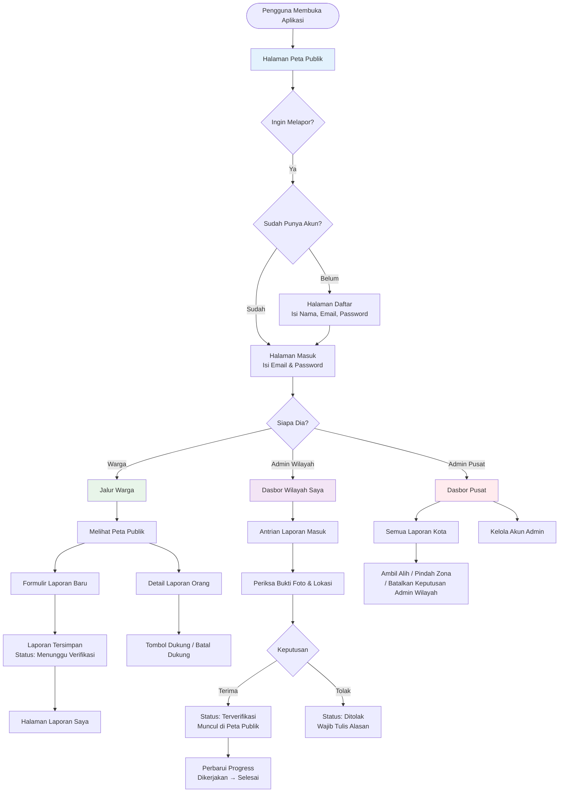

# User Flow - LaporRuta

## 1. Overview: Tiga Perjalanan Utama

Aplikasi ini memiliki **tiga jalur pengguna** yang saling terhubung namun ruang lingkupnya berbeda:

| Peran             | Tujuan Utama                                                                                              | Perangkat Utama       |
| ----------------- | --------------------------------------------------------------------------------------------------------- | --------------------- |
| **Warga**         | Melihat masalah di sekitar, melaporkan kerusakan, memantau laporan sendiri, mendukung laporan orang lain. | Ponsel (mobile-first) |
| **Admin Wilayah** | Memeriksa laporan masuk di zona tugasnya, memutuskan valid/tidak, memperbarui progress perbaikan.         | Komputer (desktop)    |
| **Admin Pusat**   | Mengawasi seluruh kota, mengatur admin lain, menangani laporan di zona tanpa pengelola.                   | Komputer (desktop)    |

---

## 2. Diagram Alur Global

### 2.1 Peta Navigasi Utama Aplikasi



### 2.2 Siklus Hidup Sebuah Laporan (Dari Lensa Pengguna)

```mermaid
flowchart LR
    A[Warga Mengirim Laporan] --> B[Status: Menunggu Verifikasi<br/>Hanya Warga Pemilik yang Bisa Lihat]
    B --> C{Ada Admin Wilayah<br/>di Zona Tersebut?}
    C -->|Ada| D[Masuk ke Antrian Admin Wilayah]
    C -->|Tidak Ada| E[Masuk ke Antrian Admin Pusat]

    D --> F[Admin Wilayah Memeriksa]
    E --> G[Admin Pusat Memeriksa]

    F --> H{Keputusan Admin}
    G --> H

    H -->|Diterima| I[Status: Terverifikasi<br/>Muncul di Peta Publik<br/>Bisa Didukung Warga Lain]
    H -->|Ditolak| J[Status: Ditolak<br/>Tidak Muncul di Publik<br/>Warga Lihat Alasan Penolakan]

    I --> K[Admin Update Progress]
    K -->|Dikerjakan| L[Status: Sedang Dikerjakan]
    L -->|Selesai| M[Status: Selesai<br/>Bisa Diunggah Foto Sesudah Perbaikan]

    M --> N{Warga Merasa Belum Selesai?}
    N -->|Ya| O[Minta Tinjauan Ulang<br/>Ditangani Admin Pusat]
    N -->|Tidak| P[Selesai]

    style A fill:#e8f5e9
    style I fill:#e3f2fd
    style M fill:#c8e6c9
    style J fill:#ffebee
    style O fill:#fff3e0
```



---

## 3. Alur Detail per Fitur

### 3.1 Warga: Menjelajahi Peta Publik

**Tujuan:** Melihat masalah infrastruktur di sekitar tanpa perlu login.

```
[Halaman Utama: Peta]
    │
    ├── Peta terbuka langsung, berpusat di kota default
    ├── Penanda (marker) muncul di lokasi laporan yang sudah diverifikasi
    ├── Di area padat, penanda berkelompok dengan angka jumlah
    │   └── Klik kelompok → peta memperbesar → kelompok terbuka
    │
    ├── Klik penanda tunggal
    │   └── Muncul kartu popup:
    │       ├── Judul laporan
    │       ├── Kategori (warna penanda sesuai kategori)
    │       ├── Status (bentuk penanda sesuai status)
    │       ├── Jumlah dukungan
    │       ├── Foto kecil
    │       └── Tanggal terakhir update
    │
    └── Panel Saring (Filter)
        ├── Pilih kategori: Jalan, Lampu, Drainase, Trotoar, Fasilitas
        └── Pilih status: Terverifikasi, Dikerjakan, Selesai
        └── Hasil langsung berubah di peta
```

### 3.2 Warga: Membuat Laporan Baru

**Tujuan:** Melaporkan kerusakan yang ditemui.

```
[Tombol "Laporkan Masalah" di Peta]
    │
    ├── Jika belum login → diarahkan ke Halaman Masuk
    │   └── Setelah masuk, kembali ke formulir laporan
    │
    └── [Halaman Formulir Laporan]
        │
        ├── 1. Isi Judul (maksimal 100 huruf)
        ├── 2. Isi Deskripsi (maksimal 500 huruf)
        ├── 3. Pilih Kategori (pilihan dari daftar)
        ├── 4. Isi Alamat Spesifik (maksimal 200 huruf)
        │
        ├── 5. Pilih Lokasi Administrasi (wajib)
        │   ├── Dropdown 1: Provinsi
        │   ├── Dropdown 2: Kota (muncul setelah provinsi dipilih)
        │   ├── Dropdown 3: Kecamatan (muncul setelah kota dipilih)
        │   └── Dropdown 4: Kelurahan (opsional)
        │
        ├── 6. Mini Peta Muncul
        │   └── Setelah kecamatan dipilih, mini peta memperbesar ke area tersebut
        │   └── Pengguna BISA meletakkan pin untuk lokasi tepat (opsional tapi dianjurkan)
        │       └── Jika pin diletakkan → lokasi lebih akurat
        │       └── Jika tidak → tetap bisa kirim, hanya berdasarkan kecamatan
        │
        ├── 7. Unggah Foto (1–3 foto, maksimal 5MB per foto)
        │   └── Foto dikompres otomatis agar tidak terlalu besar
        │
        └── 8. Klik "Kirim Laporan"
            ├── Jika gagal → muncul pesan error, tetap di formulir
            └── Jika sukses
                ├── Muncul pesan: "Laporan berhasil dikirim dan sedang menunggu verifikasi admin."
                └── Otomatis ke Halaman "Laporan Saya"
```

### 3.3 Warga: Melihat Laporan Saya

**Tujuan:** Memantau status laporan yang pernah dikirim.

```
[Halaman Laporan Saya]
    │
    ├── Daftar semua laporan milik pengguna, urutan terbaru di atas
    ├── Setiap kartu laporan menampilkan:
    │   ├── Judul
    │   ├── Ikon kategori
    │   ├── Lencana status (warna berbeda per status)
    │   ├── Tanggal kirim
    │   ├── Foto kecil
    │   └── Jumlah dukungan
    │
    ├── Jika ada laporan yang diperbarui admin sejak kunjungan terakhir
    │   └── Muncul titik merah / label "Diperbarui"
    │   └── Label hilang setelah pengguna memuat ulang halaman nanti
    │
    ├── Klik salah satu laporan
    │   └── [Halaman Detail Laporan]
    │       ├── Info lengkap laporan
    │       ├── Foto-foto bukti
    │       ├── Peta lokasi (jika ada pin)
    │       ├── Tombol Dukung (jika status sudah terverifikasi/ dikerjakan/ selesai)
    │       └── Bagian "Riwayat Aktivitas" (linimasa)
    │           ├── Waktu pengiriman
    │           ├── Waktu verifikasi + nama admin
    │           ├── Waktu perubahan status
    │           └── Kumpulan dukungan (diagregasi, misal "+5 dukungan minggu ini")
    │
    └── Jika laporan ditolak
        └── Muncul alasan penolakan dari admin
```

### 3.4 Warga: Memberikan Dukungan (Upvote)

**Tujuan:** Menyuarakan urgensi laporan orang lain agar cepat ditangani.

```
[Di Halaman Detail Laporan atau Popup Peta]
    │
    ├── Tombol "Dukung" terlihat di setiap laporan yang sudah terverifikasi
    │
    ├── Jika belum login
    │   └── Klik tombol → muncul jendela ajakan login
    │       └── Setelah login, kembali ke halaman detail, bisa dukung
    │
    ├── Jika sudah login
    │   ├── Klik "Dukung" → angka langsung naik 1 di layar (tanpa nunggu)
    │   ├── Klik lagi pada laporan yang sudah didukung → angka turun 1 (batal dukung)
    │   └── Setiap tindakan tercatat di riwayat transparansi
    │
    └── Angka dukungan mempengaruhi peringkat prioritas di dasbor admin
```

### 3.5 Admin Wilayah: Memeriksa & Memutuskan Laporan

**Tujuan:** Memastikan hanya laporan valid yang masuk ke peta publik.

```
[Dasbor Admin Wilayah - Tab "Menunggu Verifikasi"]
    │
    ├── Hanya muncul laporan di zona tugas admin tersebut
    ├── Laporan baru bisa muncul secara langsung tanpa perlu refresh halaman
    │   └── Kartu laporan baru berkedip/bersorot selama 3 detik
    │
    ├── Klik sebuah laporan untuk memeriksa detail:
    │   ├── Foto bukti (bisa diperbesar)
    │   ├── Judul & deskripsi
    │   ├── Alamat spesifik
    │   ├── Lokasi di peta
    │   ├── Nama warga pelapor
    │   └── Tanggal pengiriman
    │
    └── Dua Tombol Keputusan:
        │
        ├── [Terima / Verifikasi]
        │   └── Status berubah menjadi "Terverifikasi"
        │   └── Laporan langsung muncul di peta publik
        │   └── Warga bisa mulai memberikan dukungan
        │
        └── [Tolak]
            └── Wajib mengisi alasan penolakan (minimal 10 huruf)
            └── Status berubah menjadi "Ditolak"
            └── Tidak akan muncul di peta publik
            └── Warga pemilik bisa melihat alasan penolakan di "Laporan Saya"
```

### 3.6 Admin Wilayah: Memperbarui Progress Perbaikan

**Tujuan:** Memberi tahu warga bahwa masalah sedang/sudah ditangani.

```
[Dasbor Admin Wilayah - Tab "Sedang Berjalan"]
    │
    ├── Laporan yang sudah diverifikasi muncul di sini
    ├── Pilih laporan → klik "Perbarui Status"
    │
    ├── Status hanya bisa maju, tidak bisa mundur:
    │   Terverifikasi → Sedang Dikerjakan → Selesai
    │
    ├── Saat menandai "Selesai":
    │   └── Admin BISA mengunggah foto sesudah perbaikan (maksimal 3 foto)
    │   └── Foto ini ditandai khusus sebagai "bukti perbaikan"
    │
    └── Setiap perubahan status:
        ├── Tercatat di riwayat aktivitas laporan
        ├── Memicu lencana "Diperbarui" di halaman "Laporan Saya" warga
        └── Peta publik langsung memperbarui warna/bentuk penanda
```

### 3.7 Admin Wilayah: Catatan Internal

**Tujuan:** Berkoordinasi dengan tim internal tanpa warga melihatnya.

```
[Di Halaman Detail Laporan - Bagian Admin Only]
    │
    ├── Kolom teks "Catatan Internal"
    │   └── Contoh: "Suku cadang dipesan, estimasi 3 hari"
    ├── Klik "Simpan Catatan"
    │   └── Catatan hanya terlihat oleh admin
    │   └── Tidak muncul di linimasa publik
    └── Bisa diedit kapan saja
```

### 3.8 Admin Pusat: Mengawasi & Mengambil Alih

**Tujuan:** Mengontrol keseluruhan sistem dan memperbaiki kesalahan.

```
[Dasbor Admin Pusat]
    │
    ├── Melihat SEMUA laporan di SEMUA zona
    ├── Bisa menyaring berdasarkan: zona, kategori, status, rentang tanggal, kata kunci
    ├── Bisa mengurutkan berdasarkan: skor prioritas, terbaru, terlama, jumlah dukungan
    │
    ├── Tab "Zona Tanpa Admin"
    │   └── Laporan dari kecamatan yang belum punya admin wilayah
    │   └── Admin pusat bisa verifikasi langsung, atau tugaskan admin baru ke zona itu
    │
    └── Aksi Khusus Admin Pusat:
        │
        ├── [Pindah Zona]
        │   └── Pindahkan laporan dari Kecamatan A ke Kecamatan B
        │   └── Jika zona baru punya admin, laporan masuk ke antrian admin baru
        │   └── Jika tidak punya, tetap di antrian pusat
        │
        ├── [Batalkan Keputusan / Override]
        │   └── Bisa mengubah status ke arah mana pun
        │       └── Contoh: Mengembalikan "Selesai" menjadi "Sedang Dikerjakan"
        │       └── Contoh: Menolak laporan yang sudah diterima admin wilayah
        │   └── Semua aksi ini ditandai khusus di riwayat transparansi
        │
        └── [Edit Info Laporan]
            └── Bisa mengubah judul, deskripsi, atau kategori jika ada kesalahan input warga
```

### 3.9 Admin Pusat: Mengelola Akun Admin

**Tujuan:** Menambah, menonaktifkan, atau mengatur admin lain.

```
[Dasbor Admin Pusat - Menu "Kelola Admin"]
    │
    ├── Daftar semua akun admin (wilayah & pusat)
    │
    ├── [Undang Admin Baru]
    │   ├── Masukkan email
    │   ├── Pilih peran: Admin Wilayah / Admin Pusat
    │   ├── Jika Admin Wilayah → wajib pilih satu kecamatan yang ditugasi
    │   ├── Sistem membuat link undangan (berlaku 24 jam)
    │   └── Link bisa dikirim via email, atau disalin manual
    │
    ├── [Nonaktifkan / Aktifkan]
    │   └── Toggle status akun admin
    │   └── Admin yang dinonaktifkan langsung tidak bisa masuk dasbor
    │
    ├── [Pindah Tugas]
    │   └── Pindahkan Admin Wilayah dari Kecamatan X ke Kecamatan Y
    │
    └── [Hapus Akun]
        └── Admin Pusat terakhir TIDAK BISA dihapus (pengaman sistem)
```

---

## 4. Branching Logic Gates (Dari Sudut Pandang Pengguna)

### 4.1 Gerbang Akses Halaman

| Situasi Pengguna                  | Saat Mengakses...           | Apa yang Terjadi?                                                     |
| --------------------------------- | --------------------------- | --------------------------------------------------------------------- |
| Belum login                       | Halaman Peta `/`            | Bisa lihat peta & filter, tapi tombol "Laporkan" mengarahkan ke login |
| Belum login                       | Formulir Laporan            | Diarahkan ke login, setelah masuk balik ke formulir                   |
| Belum login                       | Tombol Dukung               | Muncul jendela ajakan login                                           |
| Sudah login sebagai Warga         | Dasbor Admin `/admin/*`     | Diarahkan ke Peta Publik dengan pesan "Akses ditolak"                 |
| Sudah login sebagai Admin Wilayah | Dasbor Pusat `/admin/pusat` | Diarahkan ke Dasbor Wilayah-nya sendiri                               |
| Sudah login                       | Halaman Login/Register      | Diarahkan ke halaman default peran masing-masing                      |

### 4.2 Gerbang Keputusan di Formulir Laporan

| Kondisi                                      | Hasil                                                                     |
| -------------------------------------------- | ------------------------------------------------------------------------- |
| Pengguna memilih Provinsi → Kota → Kecamatan | Mini peta otomatis memperbesar ke area kecamatan tersebut                 |
| Pengguna meletakkan pin di mini peta         | Lokasi disimpan presisi (koordinat)                                       |
| Pengguna TIDAK meletakkan pin                | Laporan tetap bisa dikirim, hanya pakai data kecamatan                    |
| Foto gagal diunggah                          | Seluruh laporan dibatalkan, pengguna tetap di formulir dengan pesan error |
| Semua data valid                             | Laporan tersimpan, pengguna diarahkan ke "Laporan Saya"                   |

### 4.3 Gerbang Keputusan Admin

| Kondisi                                     | Siapa yang Bisa?                           | Batasan                                       |
| ------------------------------------------- | ------------------------------------------ | --------------------------------------------- |
| Menerima / Menolak laporan masuk            | Admin Wilayah (zona sendiri) & Admin Pusat | Admin Wilayah zona lain tidak bisa lihat      |
| Menolak laporan                             | Semua admin yang berwenang                 | Wajib isi alasan minimal 10 huruf             |
| Update status maju (→ Dikerjakan → Selesai) | Admin Wilayah (zona sendiri) & Admin Pusat | Tidak bisa mundurkan status                   |
| Update status mundur (Selesai → Dikerjakan) | Hanya Admin Pusat                          | Ditandai sebagai "tindakan khusus" di riwayat |
| Mengedit judul/deskripsi laporan            | Hanya Admin Pusat                          | -                                             |
| Memindahkan laporan antar kecamatan         | Hanya Admin Pusat                          | -                                             |

### 4.4 Gerbang Dukungan (Upvote)

| Kondisi                                        | Tombol Dukung                                   |
| ---------------------------------------------- | ----------------------------------------------- |
| Laporan status masih "Menunggu Verifikasi"     | Tidak muncul / tidak aktif                      |
| Laporan sudah terverifikasi/dikerjakan/selesai | Aktif, bisa diklik                              |
| Pengguna belum pernah dukung                   | Tampilan: "Dukung (0)" → klik jadi "Dukung (1)" |
| Pengguna sudah pernah dukung                   | Tampilan sudah aktif → klik lagi membatalkan    |
| Pengguna adalah Admin                          | Tombol dukung tidak tersedia                    |

---

## 5. Alur Kasus Khusus (Edge Cases)

### 5.1 Sesi Berakhir Saat Sedang Mengisi Formulir

```
Skenario: Warga sedang mengisi formulir laporan, tiba-tiba sesi habis.
Alur:
    1. Saat klik "Kirim", sistem mendeteksi sesi tidak valid
    2. Muncul halaman login di atas formulir (overlay/modal)
    3. Pengguna login ulang
    4. Formulir tetap terisi seperti semula (data tidak hilang)
    5. Pengguna klik "Kirim" lagi
```

### 5.2 Peta Tidak Bisa Dimuat

```
Skenario: Koneksi internet buruk, peta dasar tidak muncul.
Alur:
    1. Penanda laporan tetap ditampilkan berdasarkan data yang sudah dimuat
    2. Muncul pesan ramah: "Peta tidak dapat dimuat sepenuhnya. Periksa koneksi internet."
    3. Tombol "Muat Ulang Peta" tersedia
    4. Pengguna masih bisa klik penanda dan lihat detail laporan
```

### 5.3 Laporan di Zona Tanpa Admin

```
Skenario: Warga melaporkan masalah di Kecamatan X, tapi belum ada admin wilayah yang ditugaskan di sana.
Alur:
    1. Warga tetap bisa kirim laporan seperti biasa
    2. Status tetap "Menunggu Verifikasi"
    3. Laporan masuk ke antrian khusus "Zona Tanpa Admin" di Dasbor Admin Pusat
    4. Admin Pusat bisa langsung verifikasi, atau menugaskan admin baru ke zona tersebut
    5. Jika admin baru ditugaskan, laporan otomatis muncul di dasbor admin tersebut
```

### 5.4 Laporan yang Sudah Selesai Dianggap Belum Selesai

```
Skenario: Warga melihat laporannya sudah ditandai "Selesai", tapi di lapangan belum benar-benar diperbaiki.
Alur:
    1. Di halaman detail laporan miliknya, warga klik "Minta Tinjauan Ulang"
    2. Sistem membuat penanda khusus untuk Admin Pusat
    3. Admin Pusat melihat penanda tersebut di dasbor
    4. Admin Pusat bisa menurunkan status kembali ke "Sedang Dikerjakan" atau "Terverifikasi"
    5. Riwayat tercatat: "Status diubah oleh Admin Pusat karena permintaan tinjauan ulang"
```

### 5.5 Link Undangan Admin Kadaluarsa

```
Skenario: Calon admin mengklik link undangan setelah 24 jam.
Alur:
    1. Sistem menolak dengan pesan: "Link undangan telah kadaluarsa."
    2. Tampilkan tombol "Kembali ke Login"
    3. Admin Pusat harus membuat undangan baru jika masih diperlukan
```

### 5.6 Admin Dinonaktifkan Saat Sedang Bekerja

```
Skenario: Admin Pusat menonaktifkan akun Admin Wilayah saat sedang online.
Alur:
    1. Saat Admin Wilayah melakukan aksi berikutnya (klik tombol, pindah halaman)
    2. Sistem menolak dengan pesan: "Akun Anda telah dinonaktifkan."
    3. Otomatis keluar dari dasbor
    4. Diarahkan ke halaman login
```

### 5.7 Laporan Serupa Sudah Ada (Deteksi Duplikat)

```
Skenario: Warga hendak melaporkan jalan berlubang, tapi ada laporan serupa dalam radius 100 meter, kategori sama, umur kurang dari 7 hari.
Alur:
    1. Sebelum formulir terkirim, muncul jendela peringatan:
       "Laporan serupa ditemukan di dekat lokasi ini."
    2. Tampilkan ringkasan laporan yang sudah ada
    3. Dua pilihan:
       ├── [Lihat Laporan] → diarahkan ke detail laporan yang sudah ada → bisa dukung
       └── [Lanjutkan Tetap Laporkan] → formulir dikirim seperti biasa
    4. Sistem tidak memaksa, hanya menyarankan
```

### 5.8 Koneksi Real-Time Terputus

```
Skenario: Pengguna sedang melihat peta atau dasbor, koneksi websocket terputus.
Alur:
    1. Di pojok layar muncul indikator halus: "Menyambungkan kembali..."
    2. Data yang sudah dimuat tetap terlihat (tidak blank)
    3. Sistem mencoba sambung ulang secara otomatis
    4. Jika berhasil sambung:
       └── Data terbaru langsung disinkronkan, indikator hilang
    5. Jika gagal terus:
       └── Indikator berubah: "Mode offline - data mungkin tidak terbaru"
       └── Pengguna tetap bisa navigasi, tapi perlu refresh manual untuk update terbaru
```

---

## 6. Daftar Halaman (Screen Inventory)

| Nama Halaman         | Peran         | Kapan Muncul                              |
| -------------------- | ------------- | ----------------------------------------- |
| **Peta Publik**      | Semua         | Halaman utama aplikasi                    |
| **Masuk**            | Semua         | Saat akses fitur yang butuh login         |
| **Daftar**           | Warga baru    | Saat belum punya akun                     |
| **Formulir Laporan** | Warga (login) | Saat klik "Laporkan"                      |
| **Laporan Saya**     | Warga (login) | Daftar laporan pribadi                    |
| **Detail Laporan**   | Semua         | Saat klik penanda peta atau kartu laporan |
| **Dasbor Wilayah**   | Admin Wilayah | Setelah login                             |
| **Dasbor Pusat**     | Admin Pusat   | Setelah login                             |
| **Kelola Admin**     | Admin Pusat   | Dari menu dasbor pusat                    |
| **Tidak Ditemukan**  | Semua         | Saat URL tidak valid                      |

---

_End of Document_
