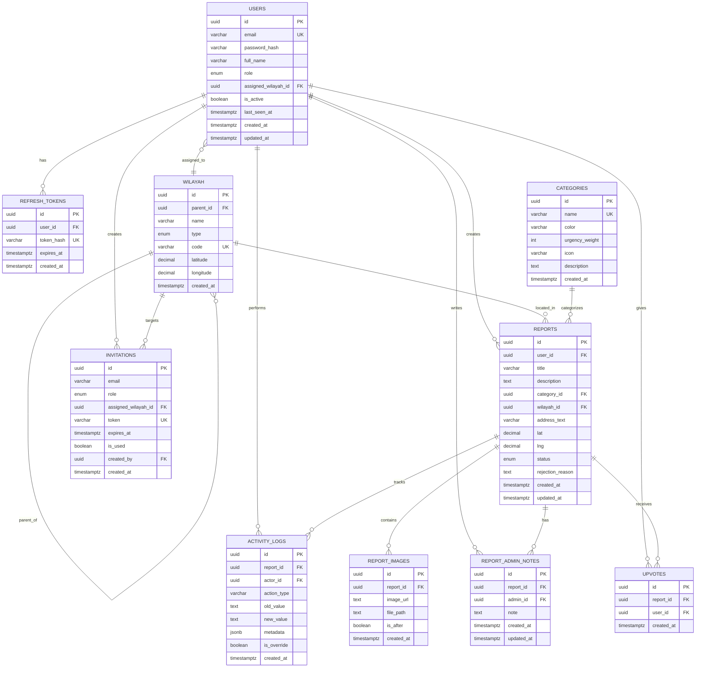

# Database Design - LaporRuta

## 1. Entity Relationship Diagram (ERD)

Diagram berikut menggambarkan seluruh entitas data, kunci primar, kunci asing, dan kardinalitas absolut antar entitas dalam sistem LaporRuta.

---

## 2. Data Dictionary Matrix

### 2.1 `users`

Tabel utama untuk seluruh pengguna aplikasi (warga, admin wilayah, admin pusat).

| Column Name           | Data Type      | Constraints                                                                                  | Description                                                                                     |
| --------------------- | -------------- | -------------------------------------------------------------------------------------------- | ----------------------------------------------------------------------------------------------- |
| `id`                  | `uuid`         | **PK**, `DEFAULT gen_random_uuid()`                                                          | Identitas unik pengguna.                                                                        |
| `email`               | `varchar(255)` | **NN**, **UQ**                                                                               | Alamat email untuk autentikasi; harus unik.                                                     |
| `password_hash`       | `varchar(255)` | **NN**                                                                                       | Hash password (bcrypt); tidak pernah menyimpan plain text.                                      |
| `full_name`           | `varchar(255)` | **NN**                                                                                       | Nama lengkap pengguna.                                                                          |
| `role`                | `varchar(50)`  | **NN**, `DEFAULT 'user'`, `CHECK (role IN ('user', 'admin_wilayah', 'admin_pusat'))`         | Peran akses pengguna.                                                                           |
| `assigned_wilayah_id` | `uuid`         | **FK** → `wilayah.id)`, `CHECK (role != 'admin_wilayah' OR assigned_wilayah_id IS NOT NULL)` | Zona tugas (wajib diisi jika `role = 'admin_wilayah'`).                                         |
| `is_active`           | `boolean`      | **NN**, `DEFAULT true`                                                                       | Status aktif akun; jika `false`, pengguna tidak bisa login.                                     |
| `last_seen_at`        | `timestamptz`  | **NUL**                                                                                      | Timestamp kunjungan terakhir pengguna; digunakan untuk indikator "Pembaruan Baru" (MVP global). |
| `created_at`          | `timestamptz`  | **NN**, `DEFAULT now()`                                                                      | Waktu registrasi akun.                                                                          |
| `updated_at`          | `timestamptz`  | **NN**, `DEFAULT now()`                                                                      | Waktu terakhir profil diperbarui.                                                               |

---

### 2.2 `refresh_tokens`

Tabel penyimpanan refresh token untuk autentikasi JWT custom.

| Column Name  | Data Type      | Constraints                                     | Description                                              |
| ------------ | -------------- | ----------------------------------------------- | -------------------------------------------------------- |
| `id`         | `uuid`         | **PK**, `DEFAULT gen_random_uuid()`             | Identitas unik token record.                             |
| `user_id`    | `uuid`         | **NN**, **FK** → `users.id` (ON DELETE CASCADE) | Pemilik token.                                           |
| `token_hash` | `varchar(255)` | **NN**, **UQ**                                  | Hash dari refresh token (tidak menyimpan raw token).     |
| `expires_at` | `timestamptz`  | **NN**                                          | Batas waktu kedaluwarsa token (7 hari sejak penerbitan). |
| `created_at` | `timestamptz`  | **NN**, `DEFAULT now()`                         | Waktu token diterbitkan.                                 |

---

### 2.3 `wilayah`

Tabel master data lokasi administratif dengan hierarki bertingkat (Provinsi → Kota → Kecamatan → Kelurahan).

| Column Name  | Data Type       | Constraints                                                              | Description                                                                                     |
| ------------ | --------------- | ------------------------------------------------------------------------ | ----------------------------------------------------------------------------------------------- |
| `id`         | `uuid`          | **PK**, `DEFAULT gen_random_uuid()`                                      | Identitas unik wilayah.                                                                         |
| `parent_id`  | `uuid`          | **FK** → `wilayah.id` (ON DELETE CASCADE)                                | Referensi ke wilayah induk (self-referencing); `NULL` untuk entitas level tertinggi (Provinsi). |
| `name`       | `varchar(255)`  | **NN**                                                                   | Nama wilayah (misal: "Tebet", "Jakarta Selatan").                                               |
| `type`       | `varchar(50)`   | **NN**, `CHECK (type IN ('provinsi', 'kota', 'kecamatan', 'kelurahan'))` | Level hierarki wilayah.                                                                         |
| `code`       | `varchar(50)`   | **UQ**, **NUL**                                                          | Kode administratif resmi (opsional, untuk referensi eksternal).                                 |
| `latitude`   | `decimal(10,8)` | **NUL**                                                                  | Titik pusat wilayah untuk auto-zoom mini peta.                                                  |
| `longitude`  | `decimal(11,8)` | **NUL**                                                                  | Titik pusat wilayah untuk auto-zoom mini peta.                                                  |
| `created_at` | `timestamptz`   | **NN**, `DEFAULT now()`                                                  | Waktu entri wilayah dibuat.                                                                     |

---

### 2.4 `categories`

Tabel master kategori kerusakan infrastruktur dengan bobot urgensi dan kode warna peta.

| Column Name      | Data Type      | Constraints                                                   | Description                                           |
| ---------------- | -------------- | ------------------------------------------------------------- | ----------------------------------------------------- |
| `id`             | `uuid`         | **PK**, `DEFAULT gen_random_uuid()`                           | Identitas unik kategori.                              |
| `name`           | `varchar(100)` | **NN**, **UQ**                                                | Nama kategori (misal: "Jalan Berlubang").             |
| `color`          | `varchar(7)`   | **NN**                                                        | Kode warna hex untuk penanda peta (misal: `#EF4444`). |
| `urgency_weight` | `integer`      | **NN**, `DEFAULT 1`, `CHECK (urgency_weight BETWEEN 1 AND 5)` | Bobot urgensi (1–5) untuk perhitungan skor prioritas. |
| `icon`           | `varchar(50)`  | **NUL**                                                       | Nama ikon Lucide untuk representasi UI (opsional).    |
| `description`    | `text`         | **NUL**                                                       | Deskripsi kategori untuk tooltip/bantuan.             |
| `created_at`     | `timestamptz`  | **NN**, `DEFAULT now()`                                       | Waktu kategori dibuat.                                |

---

### 2.5 `reports`

Tabel inti untuk laporan kerusakan infrastruktur dari warga.

| Column Name        | Data Type       | Constraints                                                                                                                               | Description                                                                               |
| ------------------ | --------------- | ----------------------------------------------------------------------------------------------------------------------------------------- | ----------------------------------------------------------------------------------------- |
| `id`               | `uuid`          | **PK**, `DEFAULT gen_random_uuid()`                                                                                                       | Identitas unik laporan.                                                                   |
| `user_id`          | `uuid`          | **NN**, **FK** → `users.id` (ON DELETE RESTRICT)                                                                                          | Pelapor; tidak boleh dihapus jika masih memiliki laporan.                                 |
| `title`            | `varchar(100)`  | **NN**                                                                                                                                    | Judul laporan (maks. 100 karakter).                                                       |
| `description`      | `text`          | **NN**                                                                                                                                    | Deskripsi detail kerusakan (maks. 500 karakter).                                          |
| `category_id`      | `uuid`          | **NN**, **FK** → `categories.id`                                                                                                          | Kategori kerusakan.                                                                       |
| `wilayah_id`       | `uuid`          | **NN**, **FK** → `wilayah.id`                                                                                                             | Lokasi administratif laporan (kecamatan/kelurahan).                                       |
| `address_text`     | `varchar(200)`  | **NN**                                                                                                                                    | Alamat spesifik teks bebas (maks. 200 karakter).                                          |
| `lat`              | `decimal(10,8)` | **NUL**                                                                                                                                   | Latitude pin lokasi (opsional, tapi dianjurkan).                                          |
| `lng`              | `decimal(11,8)` | **NUL**                                                                                                                                   | Longitude pin lokasi (opsional, tapi dianjurkan).                                         |
| `status`           | `varchar(50)`   | **NN**, `DEFAULT 'pending_verification'`, `CHECK (status IN ('pending_verification', 'verified', 'in_progress', 'resolved', 'rejected'))` | Status siklus hidup laporan.                                                              |
| `rejection_reason` | `text`          | **NUL**                                                                                                                                   | Alasan penolakan (wajib diisi jika status = `rejected`, minimal 10 karakter di aplikasi). |
| `created_at`       | `timestamptz`   | **NN**, `DEFAULT now()`                                                                                                                   | Waktu laporan dikirim.                                                                    |
| `updated_at`       | `timestamptz`   | **NN**, `DEFAULT now()`                                                                                                                   | Waktu terakhir laporan diperbarui; memicu indikator "Pembaruan Baru".                     |

> **Catatan Komputasi:** Kolom `priority_score` tidak disimpan sebagai generated column karena bergantung pada agregasi tabel `upvotes` (cross-table dependency). Skor dihitung di level aplikasi menggunakan formula: `(Upvotes × 3) + (Category_Urgency_Weight × 5) + (Has_Coordinate ? 2 : 0) − (Report_Age_in_Days × 0.5)`.

---

### 2.6 `report_images`

Tabel referensi gambar laporan yang tersimpan di Supabase Storage (diakses via backend proxy).

| Column Name  | Data Type     | Constraints                                       | Description                                                                             |
| ------------ | ------------- | ------------------------------------------------- | --------------------------------------------------------------------------------------- |
| `id`         | `uuid`        | **PK**, `DEFAULT gen_random_uuid()`               | Identitas unik gambar.                                                                  |
| `report_id`  | `uuid`        | **NN**, **FK** → `reports.id` (ON DELETE CASCADE) | Laporan pemilik gambar.                                                                 |
| `image_url`  | `text`        | **NN**                                            | URL publik gambar di Supabase Storage.                                                  |
| `file_path`  | `text`        | **NN**                                            | Path internal di Supabase Storage (diperlukan untuk cleanup atomic transaction).        |
| `is_after`   | `boolean`     | **NN**, `DEFAULT false`                           | Penanda gambar bukti perbaikan (hanya bisa diunggah oleh admin saat status `resolved`). |
| `created_at` | `timestamptz` | **NN**, `DEFAULT now()`                           | Waktu unggah.                                                                           |

---

### 2.7 `upvotes`

Tabel dukungan komunitas untuk laporan terverifikasi.

| Column Name  | Data Type     | Constraints                                       | Description                                                              |
| ------------ | ------------- | ------------------------------------------------- | ------------------------------------------------------------------------ |
| `id`         | `uuid`        | **PK**, `DEFAULT gen_random_uuid()`               | Identitas unik upvote.                                                   |
| `report_id`  | `uuid`        | **NN**, **FK** → `reports.id` (ON DELETE CASCADE) | Laporan yang di-upvote.                                                  |
| `user_id`    | `uuid`        | **NN**, **FK** → `users.id` (ON DELETE CASCADE)   | Pengguna yang memberikan upvote.                                         |
| `created_at` | `timestamptz` | **NN**, `DEFAULT now()`                           | Waktu upvote diberikan.                                                  |
|              |               | **UQ** `(report_id, user_id)`                     | Satu pengguna hanya bisa upvote satu kali per laporan (toggle behavior). |

---

### 2.8 `report_admin_notes`

Tabel catatan internal admin yang tidak terlihat oleh publik.

| Column Name  | Data Type     | Constraints                                       | Description                                                      |
| ------------ | ------------- | ------------------------------------------------- | ---------------------------------------------------------------- |
| `id`         | `uuid`        | **PK**, `DEFAULT gen_random_uuid()`               | Identitas unik catatan.                                          |
| `report_id`  | `uuid`        | **NN**, **FK** → `reports.id` (ON DELETE CASCADE) | Laporan yang diberi catatan.                                     |
| `admin_id`   | `uuid`        | **NN**, **FK** → `users.id` (ON DELETE CASCADE)   | Admin penulis catatan.                                           |
| `note`       | `text`        | **NN**                                            | Isi catatan internal (misal: "Suku cadang dipesan, ETA 3 hari"). |
| `created_at` | `timestamptz` | **NN**, `DEFAULT now()`                           | Waktu catatan dibuat.                                            |
| `updated_at` | `timestamptz` | **NN**, `DEFAULT now()`                           | Waktu catatan terakhir diubah.                                   |

---

### 2.9 `activity_logs`

Tabel audit trail immutable untuk mencatat seluruh tindakan pada laporan.

| Column Name   | Data Type     | Constraints                                       | Description                                                                                                                                                |
| ------------- | ------------- | ------------------------------------------------- | ---------------------------------------------------------------------------------------------------------------------------------------------------------- |
| `id`          | `uuid`        | **PK**, `DEFAULT gen_random_uuid()`               | Identitas unik log.                                                                                                                                        |
| `report_id`   | `uuid`        | **NN**, **FK** → `reports.id` (ON DELETE CASCADE) | Laporan terkait tindakan.                                                                                                                                  |
| `actor_id`    | `uuid`        | **FK** → `users.id` (ON DELETE SET NULL)          | Pelaku tindakan; `NULL` jika pengguna dihapus (preservasi log).                                                                                            |
| `action_type` | `varchar(50)` | **NN**                                            | Jenis tindakan: `report_created`, `upvote_added`, `upvote_removed`, `verified`, `rejected`, `status_changed`, `zone_reassigned`, `override`, `note_added`. |
| `old_value`   | `text`        | **NUL**                                           | Nilai sebelum perubahan (misal: status lama, zona lama).                                                                                                   |
| `new_value`   | `text`        | **NUL**                                           | Nilai setelah perubahan (misal: status baru, zona baru).                                                                                                   |
| `metadata`    | `jsonb`       | **NUL**                                           | Konteks tambahan fleksibel dalam format JSON (misal: `{ "rejection_reason": "...", "upvote_delta": 5 }`).                                                  |
| `is_override` | `boolean`     | **NN**, `DEFAULT false`                           | Penanda `true` jika tindakan dilakukan oleh Admin Pusat sebagai override.                                                                                  |
| `created_at`  | `timestamptz` | **NN**, `DEFAULT now()`                           | Waktu tindakan terjadi (immutable).                                                                                                                        |

---

### 2.10 `invitations`

Tabel undangan pembuatan akun admin oleh Admin Pusat.

| Column Name           | Data Type      | Constraints                                                                                 | Description                                         |
| --------------------- | -------------- | ------------------------------------------------------------------------------------------- | --------------------------------------------------- |
| `id`                  | `uuid`         | **PK**, `DEFAULT gen_random_uuid()`                                                         | Identitas unik undangan.                            |
| `email`               | `varchar(255)` | **NN**                                                                                      | Email calon admin.                                  |
| `role`                | `varchar(50)`  | **NN**, `CHECK (role IN ('admin_wilayah', 'admin_pusat'))`                                  | Peran yang ditawarkan.                              |
| `assigned_wilayah_id` | `uuid`         | **FK** → `wilayah.id`, `CHECK (role != 'admin_wilayah' OR assigned_wilayah_id IS NOT NULL)` | Zona tugas (wajib jika `role = 'admin_wilayah'`).   |
| `token`               | `varchar(255)` | **NN**, **UQ**                                                                              | Token unik untuk link registrasi admin.             |
| `expires_at`          | `timestamptz`  | **NN**                                                                                      | Batas waktu berlaku undangan (24 jam sejak dibuat). |
| `is_used`             | `boolean`      | **NN**, `DEFAULT false`                                                                     | Penanda apakah undangan sudah diklaim.              |
| `created_by`          | `uuid`         | **NN**, **FK** → `users.id` (ON DELETE CASCADE)                                             | Admin Pusat yang mengirim undangan.                 |
| `created_at`          | `timestamptz`  | **NN**, `DEFAULT now()`                                                                     | Waktu undangan dibuat.                              |

---

## 3. Performance Optimization Plan

### 3.1 Indexing Strategy

| Index Name                     | Table                | Columns                                    | Type            | Purpose                                                                                                      |
| ------------------------------ | -------------------- | ------------------------------------------ | --------------- | ------------------------------------------------------------------------------------------------------------ |
| `idx_users_email`              | `users`              | `email`                                    | B-Tree, Unique  | Lookup autentikasi login.                                                                                    |
| `idx_users_role_active`        | `users`              | `role`, `is_active`                        | B-Tree          | Filter aktif berdasarkan peran (admin management).                                                           |
| `idx_users_assigned_wilayah`   | `users`              | `assigned_wilayah_id`, `role`, `is_active` | B-Tree          | Penugasan otomatis laporan ke admin wilayah & fallback check.                                                |
| `idx_refresh_tokens_hash`      | `refresh_tokens`     | `token_hash`                               | B-Tree, Unique  | Validasi refresh token saat renew access token.                                                              |
| `idx_refresh_tokens_user`      | `refresh_tokens`     | `user_id`, `expires_at`                    | B-Tree          | Cleanup token expired per user.                                                                              |
| `idx_wilayah_parent`           | `wilayah`            | `parent_id`, `type`                        | B-Tree          | Query hierarki dropdown bertingkat (Provinsi→Kota→Kecamatan).                                                |
| `idx_wilayah_code`             | `wilayah`            | `code`                                     | B-Tree, Unique  | Lookup kode administratif.                                                                                   |
| `idx_reports_user_created`     | `reports`            | `user_id`, `created_at DESC`               | B-Tree          | Halaman "Laporan Saya" (sort terbaru).                                                                       |
| `idx_reports_category_status`  | `reports`            | `category_id`, `status`                    | B-Tree          | Filter peta publik berdasarkan kategori & status.                                                            |
| `idx_reports_wilayah_status`   | `reports`            | `wilayah_id`, `status`                     | B-Tree          | Dasbor admin wilayah - filter laporan per zona.                                                              |
| `idx_reports_updated_at`       | `reports`            | `updated_at`                               | B-Tree          | Indikator "Pembaruan Baru" (`updated_at > last_seen_at`).                                                    |
| `idx_reports_pending_wilayah`  | `reports`            | `wilayah_id`                               | B-Tree, Partial | **Partial Index** `WHERE status = 'pending_verification'`. Mempercepat antrian verifikasi admin.             |
| `idx_reports_public_map`       | `reports`            | `wilayah_id`, `category_id`                | B-Tree, Partial | **Partial Index** `WHERE status IN ('verified', 'in_progress', 'resolved')`. Mempercepat render peta publik. |
| `idx_report_images_report`     | `report_images`      | `report_id`, `is_after`                    | B-Tree          | Ambil gambar (termasuk bukti perbaikan) per laporan.                                                         |
| `idx_upvotes_unique`           | `upvotes`            | `report_id`, `user_id`                     | B-Tree, Unique  | Pencegahan duplikat & toggle upvote.                                                                         |
| `idx_upvotes_report_count`     | `upvotes`            | `report_id`                                | B-Tree          | Agregasi jumlah upvote per laporan.                                                                          |
| `idx_admin_notes_report`       | `report_admin_notes` | `report_id`                                | B-Tree          | Ambil catatan internal per laporan.                                                                          |
| `idx_activity_logs_report`     | `activity_logs`      | `report_id`, `created_at DESC`             | B-Tree          | Timeline aktivitas laporan (sort kronologis terbaru).                                                        |
| `idx_activity_logs_override`   | `activity_logs`      | `is_override`, `created_at DESC`           | B-Tree          | Audit khusus tindakan override Admin Pusat.                                                                  |
| `idx_invitations_token`        | `invitations`        | `token`                                    | B-Tree, Unique  | Validasi link undangan admin.                                                                                |
| `idx_invitations_email_unused` | `invitations`        | `email`, `is_used`, `expires_at`           | B-Tree          | Cek undangan aktif per email.                                                                                |

### 3.2 Query Optimization Policies

1. **Hierarki Wilayah (Adjacency List):** Gunakan **Recursive CTE** PostgreSQL untuk query dropdown bertingkat dan validasi parent-child, mengingat kedalaman hierarki tetap (maks. 4 level: Provinsi → Kota → Kecamatan → Kelurahan).
2. **Priority Score Computation:** Karena melibatkan agregasi `COUNT(upvotes)` dan lookup `categories.urgency_weight`, skor dihitung **di level aplikasi (Express)**. Untuk optimasi, gunakan **subquery terkorelasi** atau **JOIN dengan CTE agregasi** saat query dasbor admin, bukan generated column.
3. **Deteksi Duplikat (Radius Search):** Untuk pengecekan laporan serupa dalam radius 100m (Should-Have S-01), gunakan perbandingan Haversine di aplikasi atau ekstensi `cube`/`earthdistance` PostgreSQL jika diizinkan. Tanpa ekstensi, gunakan bounding box sederhana (`lat ± delta`, `lng ± delta`) sebagai pre-filter sebelum perhitungan jarak akurat.
4. **Audit Trail Aggregation:** Event `upvote` pada `activity_logs` diagregasi di aplikasi (misal: "+5 upvote minggu ini") menggunakan `GROUP BY date_trunc('week', created_at)` saat render timeline, bukan menyimpan data teragregasi di database.
5. **Soft Delete Policy:** Tidak ada penghapusan fisik (`DELETE`) pada tabel `users` dan `reports`. Gunakan kolom `is_active` (users) dan status `rejected` (reports). Penghapusan fisik hanya diizinkan pada `refresh_tokens` (expired cleanup) dan `invitations` (post-usage cleanup via background job).
6. **RLS Policy:** **Tidak diaktifkan** sesuai ADR. Semua query dari backend Express menggunakan **Service Role Key**. Tidak ada kebijakan keamanan di level database; akses dikendalikan sepenuhnya oleh middleware Express.

---

## 4. Data Seeding Specifications

### 4.1 Master Data Seeding (Wajib - Bootstrap Sistem)

Data ini harus tersedia sebelum aplikasi dapat digunakan secara fungsional.

#### A. Kategori Infrastruktur

| `name`                 | `color`   | `urgency_weight` | `icon`           | `description`                                  |
| ---------------------- | --------- | ---------------- | ---------------- | ---------------------------------------------- |
| Jalan Berlubang        | `#EF4444` | 5                | `alert-triangle` | Kerusakan jalan yang membahayakan pengendara.  |
| Tiang Listrik Roboh    | `#EF4444` | 5                | `zap-off`        | Tiang listrik miring atau roboh, berbahaya.    |
| Lampu Penerangan Mati  | `#EAB308` | 4                | `lightbulb-off`  | Lampu jalan umum tidak menyala.                |
| Drainase Tersumbat     | `#3B82F6` | 3                | `waves`          | Saluran air tersumbat menyebabkan genangan.    |
| Trotoar Rusak          | `#8B5CF6` | 2                | `footprints`     | Kerusakan jalur pejalan kaki.                  |
| Fasilitas Publik Rusak | `#10B981` | 1                | `building-2`     | Kerusakan fasilitas umum (bangku, halte, dll). |

#### B. Hierarki Wilayah (Minimal 2 Zona untuk Uji Multi-Area)

**Provinsi:** DKI Jakarta, Jawa Barat  
**Kota:** Jakarta Selatan (DKI), Jakarta Pusat (DKI), Bandung (Jabar)  
**Kecamatan:** Tebet, Setiabudi (Jaksel); Senen, Sawah Besar (Jakpus); Coblong, Cidadap (Bandung)  
**Kelurahan:** 2–3 kelurahan per kecamatan (opsional, untuk validasi form).

#### C. Akun Sistem (Default Login untuk Development)

| `full_name`    | `email`                 | `role`          | `assigned_wilayah_id`    | `is_active` |
| -------------- | ----------------------- | --------------- | ------------------------ | ----------- |
| Budi Santoso   | `warga@demo.id`         | `user`          | `NULL`                   | `true`      |
| Ibu Rina       | `admin.wilayah@demo.id` | `admin_wilayah` | `{uuid_kecamatan_tebet}` | `true`      |
| Pak Dedi       | `admin.pusat@demo.id`   | `admin_pusat`   | `NULL`                   | `true`      |
| Admin Nonaktif | `inactive@demo.id`      | `admin_wilayah` | `{uuid_kecamatan_senen}` | `false`     |

### 4.2 Functional Test Data (Uji End-to-End)

#### D. Laporan Sampel (Semua Status)

| `title`                        | `status`               | `category`             | `wilayah`   | `lat/lng` | `upvotes` | Keterangan                                              |
| ------------------------------ | ---------------------- | ---------------------- | ----------- | --------- | --------- | ------------------------------------------------------- |
| Jalan berlubang di depan pasar | `pending_verification` | Jalan Berlubang        | Tebet       | Ada       | 0         | Untuk uji antrian verifikasi admin wilayah.             |
| Lampu mati 3 hari              | `verified`             | Lampu Penerangan Mati  | Setiabudi   | Ada       | 12        | Untuk uji peta publik & upvote.                         |
| Drainase mampet Jl. Merdeka    | `in_progress`          | Drainase Tersumbat     | Sawah Besar | Tidak     | 3         | Untuk uji status sedang dikerjakan.                     |
| Trotoar retak sudah diperbaiki | `resolved`             | Trotoar Rusak          | Senen       | Ada       | 8         | Untuk uji status selesai + gambar `is_after`.           |
| Laporan hoax/palsu             | `rejected`             | Fasilitas Publik Rusak | Coblong     | Tidak     | 0         | Untuk uji penolakan dengan `rejection_reason`.          |
| Laporan zona tanpa admin       | `pending_verification` | Jalan Berlubang        | Cidadap     | Ada       | 0         | Kecamatan tanpa admin wilayah aktif; fallback ke pusat. |

#### E. Gambar Laporan

- Setiap laporan `pending`/`verified`/`in_progress` memiliki 1–3 gambar bukti (`is_after = false`).
- Laporan `resolved` memiliki 1–2 gambar bukti awal + 1–2 gambar `is_after = true` (bukti perbaikan).

#### F. Upvotes & Activity Logs

- Laporan dengan 12 upvote: seed 12 entri di `upvotes` dari berbagai user dummy.
- Seed `activity_logs` mencakung seluruh siklus hidup minimal 1 laporan: `report_created` → `verified` (Ibu Rina) → `status_changed` → `in_progress` → `status_changed` → `resolved` + `upvote_added` (diagregasi).

#### G. Undangan Admin

- 1 undangan aktif (belum digunakan, expires 24 jam dari now).
- 1 undangan kadaluarsa (`expires_at < now()`, `is_used = false`).
- 1 undangan sudah digunakan (`is_used = true`).

---

_End of Document_
